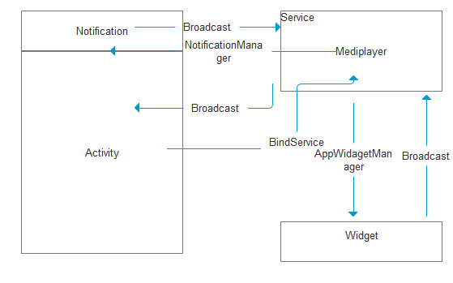

#音乐播放器
- Service：保存mediaplay对音乐进行控制
- Activity:以窗口模式显示界面
- Broadcast:组建之间传递消息
- Notification:在通知的形式显示界面
- AppWidget:以桌面小图标的方式显示界面
- ContentProivder:获取应用共享的数据

##Activity和Service之间的通信
- Activity通过绑定Service获取Service的引用，控制Service
- Activity可以通过不停的发送消息来获取Service的更新情况，从而实现Activity中的进度条

##Service和Notification之间的同信
- Service通过获取NotificationManager实现和Notification之间的通信
- 通过SetContentView自定设置Notification的界面
- 在Service中创建PendingIntent发送给Notification,让其将PengIntent中对应的intent以广播的形式发送出来
- 在Service中动态注册一个Receiver来接受Notification发出的广播，从而达到通知控制Service的功能
##Widget和Service之间的通信
- Service通过AppWidgetManager对AppWidget进行更新
- 和Notification一样，Service创建一个RemoteViews更新Widget
- 在RemoteViews中给各种控件添加PengdingIntent，让其可以发送广播，Service接受广播达到被控制的效果

