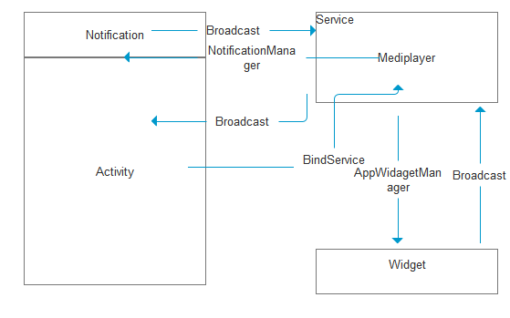

#文件管理分析项目
- Model:考虑数据的来源
- View: 界面设计

- Controller:业务逻辑
##安卓系统的文件结构
- 通过DDMS来查看设备中的相关属性
- 安卓的文件结构没有盘符的概念,只有一个盘,其根目录就是/
- sd卡的仅仅是目录下的一个文件夹
- System:系统核心文件存放的目录
- Data/data:用于存放每一个安装在手机上的app的应用缓存空间;文件夹的名字是以文件的包名命名
- 安卓系统中每一个app的包名是唯一的;用于app标识自己唯一身份
- app只有自己可以访问自己的空间目录
- mnt/sdcard:用于存放sdcard的目录
##如何获取数据
- 创建一个FileManager,对文件进行相关的操作

        public List<FileBean> getFileList(String path){
        //获取当前文件夹
        File folder = new File(path);
        List<FileBean> list = new ArrayList<FileBean>();
        //获取当前文件夹中所有的文件
        File[] listFiles = folder.listFiles();
        for (int i=0;i<listFiles.length;i++){
            File file = listFiles[i];
            FileBean fb = new FileBean();
            fb.setFileName(file.getName());
            fb.setFilePath(file.getPath());
            list.add(fb);
            //写出日志
            Log.d("filetag",fb.getFileName());
        }
        return list;
    }
